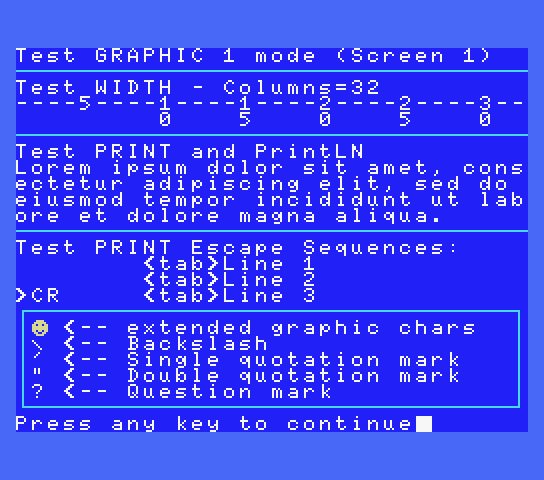

# TEXTMODE MSX-DOS Library (fR3eL Project)

```
Architecture: MSX
Format: C Object (SDCC .rel)
Programming language: C and Z80 assembler
```


## Description

This project is a library of functions for developing text-mode applications.

Supports the following display modes:
- Text 1 (screen 0, 40 columns) 
- Text 2 (screen 0, 80 columns) Requires MSX with V9938 and BIOS that supports this mode.
- Graphic 1 (screen 1, 32 columns)

This library uses the functions of the MSX BIOS, through the call to the interslot, to be used in application development for MSX-DOS.

It is designed to develop MSX applications using Small Device C Compiler (SDCC), although it is an opensource project. 
Feel free to use part or all of it to adapt it to other systems or development environments.

You can access the documentation here with [`How to use the library`](docs/HOWTO.md).

I have adapted a routine for converting a 16 Bits value to ASCII for printing numbers, extracted from the Baze collection [(WEB)](http://baze.sk/3sc/misc/z80bits.html#5.1). 

This library is part of the [MSX fR3eL Project](https://github.com/mvac7/SDCC_MSX_fR3eL).

Enjoy it!


## History of versions:

- v1.5 (22/10/2024) Update to SDCC (4.1.12) Z80 calling conventions, add functions: PrintLN, GetColumns, GetCursorRow and GetCursorColumn.
- v1.4 (04/09/2019) Integer printing functions improved (PrintNumber & PrintFNumber). num2Dec16 becomes PrintFNumber
- v1.3 (29/08/2019) nakeds and PrintNumber improvements
- v1.2 (05/05/2018)
- v1.1 (27/02/2017)


## Requirements

- [Small Device C Compiler (SDCC) v4.3](http://sdcc.sourceforge.net/)
- [Hex2bin v2.5](http://hex2bin.sourceforge.net/)


## Functions

| Function | Description |
| :---     | :---        |
| **WIDTH**(columns) | Specifies the number of characters per line in text mode |
| **COLOR**(ink, background, border) | Specifies the colors of the foreground, background, and border area |
| **SCREEN0**() | Initialice TEXT 1 (40 columns) or TEXT 2 (80 columns) screen mode |
| **SCREEN1**() | Initialice GRAPHIC 1 screen mode (32 columns x 24 lines) |
| **CLS**() | Clear Screen. Fill Pattern Name Table with 0x20 character |
| **LOCATE**(column, line) | Moves the cursor to the specified location |
| **PRINT**(text) | Displays a text string at the current cursor position |
| **PrintLN**(text) | Displays a text string at the current cursor position and adds a new line |
| **PrintNumber**(number) | Displays an unsigned integer at the current cursor position |
| **PrintFNumber**(number, emptyChar, length) | Displays an unsigned integer with formatting parameters, at the current cursor position |
| **bchput**(character) | Displays one character |
| **GetColumns**()      | Provides the columns from current screen           |
| **GetCursorRow**()    | Provides the current row-position of the cursor    |
| **GetCursorColumn**() | Provides the current column-position of the cursor |

<br/>

---

## Code Examples

In the git project [`examples/`](../examples/), you can find the source code of applications for testing and learning purposes.

<br/>

### ExampleDOS

Simple example of the use of the library (used in the documentation).

[`examples/forDoc`](examples/forDoc)


<br/>

### TestLib

Test the library functions in Text 1 (Screen 0 with 40 columns) and GRAPHIC 1 (Screen 1) modes of the TMS9918A.

[`examples/testLib`](examples/testLib)

 


<br/>

### Test80c

Test the library functions in Text 2 mode (Screen 0 with 80 columns) of V9938 or higher.

[`examples/test80c`](examples/test80c)

 

