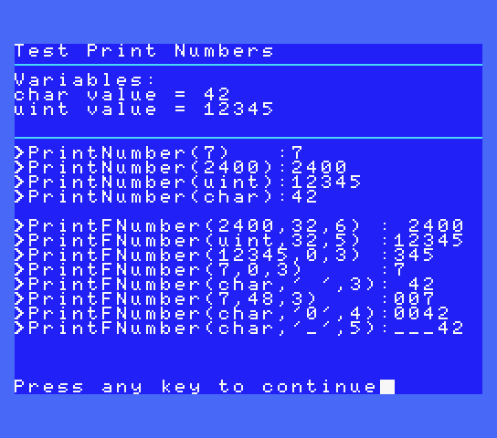

# How to use the TEXTMODE MSX ROM Library

| Attention! |
| :---       |
| The following document has been written using an English translator.<br/>You can participate in the improvement of this document, transmitting your corrections or suggestions in the issues of this project or the main fR3eL project.<br/>Thanks for understanding. |

<br/>

## Index

- [1 Description](#1-Description)
- [2 Requirements](#2-Requirements)
- [3 Definitions](#3-Definitions)
    - [3.1 Color Names](#31-Color-Names)
- [4 Functions](#4-Functions)
	- [4.1 WIDTH](#41-WIDTH)
	- [4.2 COLOR](#42-COLOR)
	- [4.3 SCREEN0](#43-SCREEN0)
	- [4.4 SCREEN1](#44-SCREEN1)
	- [4.5 CLS](#45-CLS)
	- [4.6 LOCATE](#46-LOCATE)
	- [4.7 PRINT](#47-PRINT)
	- [4.8 PrintLN](#48-PrintLN)
	- [4.9 PrintNumber](#49-PrintNumber)
	- [4.10 PrintFNumber](#410-PrintFNumber)
	- [4.11 bchput](#411-bchput)
	- [4.12 GetColumns](#412-GetColumns)
	- [4.13 GetCursorRow](#413-GetCursorRow)
	- [4.14 GetCursorColumn](#414-GetCursorColumn)
- [5 How does it work?](#5-How-does-it-work)
	- [5.1 TEXT 1 and TEXT 2 modes](#51-TEXT-1-and-TEXT-2-modes)
	- [5.2 GRAPHIC 1 mode](#52-GRAPHIC-1-mode)
	- [5.2.1 Set GRAPHIC 1 Colors](#521-Set-GRAPHIC-1-Colors)
	- [5.3 More things](#53-More-things)
- [6 Code Examples](#6-Code-Examples)
    - [6.1 ExampleDOS](#61-ExampleDOS)
	- [6.2 TestLib](#62-TestLib)
	- [6.3 Test80c](#63-Test80c)
- [7 Appendices](#7-Appendices)
    - [7.1 Escape sequences](#71-Escape-sequences)
	- [7.2 Other scape codes](#72-Other-scape-codes)
	- [7.3 Extended Graphic Characters](#73-Extended-Graphic-Characters)
- [8 References](#8-References)


<br/>

---

## 1 Description

This project is a library of functions for creating aplications in text mode.

Works in T1 (screen 0, 40 columns), T2 (screen 0, 80 columns), and G1 (screen 1, 32 columns) modes.

It uses the functions from the MSX BIOS, so it is designed to create applications in ROM format or binaries on MSX BASIC.

It is designed to develop MSX applications using Small Device C Compiler (SDCC), although it is an opensource project. Feel free to use part or all of it to adapt it to other systems or development environments.

I have adapted a routine for converting a 16 Bits value to ASCII for printing numbers, extracted from the Baze collection [(WEB)](http://baze.sk/3sc/misc/z80bits.html#5.1). 

This library is part of the [MSX fR3eL Project](https://github.com/mvac7/SDCC_MSX_fR3eL).

<br/>

---

## 2 Requirements

- [Small Device C Compiler (SDCC) v4.3](http://sdcc.sourceforge.net/)
- [Hex2bin v2.5](http://hex2bin.sourceforge.net/)


<br/>

---

## 3 Definitions

### 3.1 Color Names

Label		| Value
:---		| ---:
TRANSPARENT	| 0
BLACK		| 1
GREEN		| 2
LIGHT_GREEN	| 3
DARK_BLUE	| 4
LIGHT_BLUE	| 5
DARK_RED	| 6
CYAN		| 7
RED			| 8
LIGHT_RED	| 9
DARK_YELLOW	| 10
LIGHT_YELLOW	| 11
DARK_GREEN	| 12
MAGENTA		| 13
GRAY		| 14
GREY		| 14
WHITE		| 15


<br/>

---


## 4 Functions


### 4.1 WIDTH

<table>
<tr><td colspan=3><b>WIDTH</b></td></tr>
<tr><td colspan=3>Specifies the number of characters per line in text mode.</td></tr>
<tr><td><b>Function</b></td><td colspan=2>WIDTH(columns)</td></tr>
<tr><td rowspan=3>Input</td><td rowspan=3>[char]</td><td>1 to 40 in TEXT 1 mode (40 columns)</td></tr>
<tr><td>41 to 80 in TEXT 2 mode (80 columns)</td></tr>
<tr><td>1 to 32 in GRAPHIC 1 mode</td></tr>
<tr><td><b>Output</b></td><td colspan=2> --- </td></tr>
<tr><td><b>Example:</b></td><td colspan=2><pre>WIDTH(24);<br/>SCREEN1();</pre></td></tr>
</table>

<br/>

### 4.2 COLOR

<table>
<tr><td colspan=3><b>COLOR</b></td></tr>
<tr><td colspan=3>Specifies the colors of the foreground, background, and border area.<br/><b>Note:</b> In TEXT 1 mode the border color has no effect.</td></tr>
<tr><td><b>Function</b></td><td colspan=2>COLOR(ink, background, border)</td></tr>
<tr><td rowspan=3><b>Input</b></td><td>[char]</td><td>Ink color (0 to 15)</td></tr>
<tr><td>[char]</td><td>Background color (0 to 15)</td></tr>
<tr><td>[char]</td><td>Border color (0 to 15)</td></tr>
<tr><td><b>Output</b></td><td colspan=2> --- </td></tr>
<tr><td><b>Example:</b></td><td colspan=2><pre>COLOR(BLACK,GRAY,DARK_BLUE);</pre></td></tr>
</table>

<br/>

### 4.3 SCREEN0

<table>
<tr><td colspan=3><b>SCREEN0</b></td></tr>
<tr><td colspan=3>Initialice TEXT 1 (40 columns) or TEXT 2 (80 columns) screen mode.<br/><b>Note:</b> To set the TEXT 2 mode, you must first set 80 columns with the WIDTH function (only MSX computers with V9938 and BIOS that supports this mode).</td></tr>
<tr><td><b>Function</b></td><td colspan=2>SCREEN0()</td></tr>
<tr><td><b>Input</b></td><td colspan=2> --- </td></tr>
<tr><td><b>Output</b></td><td colspan=2> --- </td></tr>
<tr><td><b>Example:</b></td><td colspan=2><pre>WIDTH(40);<br/>SCREEN0();</pre></td></tr>
</table>

<br/>

### 4.4 SCREEN1

<table>
<tr><td colspan=3><b>SCREEN1</b></td></tr>
<tr><td colspan=3>Initialice GRAPHIC 1 screen mode (32 columns x 24 lines).</td></tr>
<tr><td><b>Function</b></td><td colspan=2>SCREEN1()</td></tr>
<tr><td><b>Input</b></td><td colspan=2> --- </td></tr>
<tr><td><b>Output</b></td><td colspan=2> --- </td></tr>
<tr><td><b>Example:</b></td><td colspan=2><pre>COLOR(14,4,5);<br/>WIDTH(32);<br/>SCREEN1();</pre></td></tr>
</table>

<br/>

### 4.5 CLS

<table>
<tr><td colspan=3><b>CLS</b></td></tr>
<tr><td colspan=3>Clear Screen.<br/>Fill Pattern Name Table with 0x20 character.</td></tr>
<tr><td><b>Function</b></td><td colspan=2>CLS()</td></tr>
<tr><td><b>Input</b></td><td colspan=2> --- </td></tr>
<tr><td><b>Output</b></td><td colspan=2> --- </td></tr>
<tr><td><b>Example:</b></td><td colspan=2><pre>CLS();</pre></td></tr>
</table>

<br/>

### 4.6 LOCATE

<table>
<tr><td colspan=3><b>LOCATE</b></td></tr>
<tr><td colspan=3>Moves the cursor to the specified location.</td></tr>
<tr><td><b>Function</b></td><td colspan=2>LOCATE(column,line)</td></tr>
<tr><td rowspan=2><b>Input</b></td><td>[char]</td><td>Position X of the cursor.<br/>TEXT 1 (0 to 39)<br/>TEXT 2 (0 to 79)<br/>GRAPHIC 1 (0 to 31)</td></tr>
<tr><td>[char]</td><td>Position Y of the cursor. (0 to 23) </td></tr>
<tr><td><b>Output</b></td><td colspan=2> --- </td></tr>
<tr><td><b>Example:</b></td><td colspan=2><pre>LOCATE(8,12);<br/>PRINT("Hello World!");</pre></td></tr>
</table>

<br/>

### 4.7 PRINT

<table>
<tr><td colspan=3><b>PRINT</b></td></tr>
<tr><td colspan=3>Displays a text string at the current cursor position.<br/>Use the LOCATE function to indicate a specific position.</td></tr>
<tr><td><b>Function</b></td><td colspan=2>PRINT(text)</td></tr>
<tr><td><b>Input</b></td><td>[char*]</td><td>String</td></tr>
<tr><td><b>Output</b></td><td colspan=2> --- </td></tr>
<tr><td><b>Example:</b></td><td colspan=2><pre>LOCATE(0,8);<br/>PRINT("\tLine 1\n\tLine 2\n\tLine 3\n");</pre></td></tr>
</table>

Read [Appendix 1](#71-Escape-sequences) for supported C escape secuences.

<br/>

### 4.8 PrintLN

<table>
<tr><td colspan=3><b>PrintLN</b></td></tr>
<tr><td colspan=3>Displays a text string at the current cursor position and adds a new line (CRLF) at the end.</td></tr>
<tr><td><b>Function</b></td><td colspan=2>PrintLN(text)</td></tr>
<tr><td><b>Input</b></td><td>[char*]</td><td>String<br/>(See escape codes table)</td></tr>
<tr><td><b>Output</b></td><td colspan=2> --- </td></tr>
<tr><td><b>Example:</b></td><td colspan=2><pre>PrintLN("Put your hands up in the air");</pre></td></tr>
</table>

<br/>

### 4.9 PrintNumber

<table>
<tr><td colspan=3><b>PrintNumber</b></td></tr>
<tr><td colspan=3>Displays an unsigned integer at the current cursor position.</td></tr>
<tr><td><b>Function</b></td><td colspan=2>PrintNumber(number)</td></tr>
<tr><td><b>Input</b></td><td>[unsigned int] or [char]</td><td>numeric value</td></tr>
<tr><td><b>Output</b></td><td colspan=2> --- </td></tr>
<tr><td rowspan=2><b>Example:</b></td><td colspan=2><pre>PrintNumber(1234);</pre></td></tr>
<tr><td colspan=2><pre>1234</pre></td></tr>
</table>

| Note: |
| :---  |
| This function operates like PrintFNumber(number,0,5); |

<br/>

### 4.10 PrintFNumber

<table>
<tr><td colspan=3><b>PrintFNumber</b></td></tr>
<tr><td colspan=3>Displays an unsigned integer with formatting parameters, at the current cursor position.</td></tr>
<tr><td><b>Function</b></td><td colspan=2>PrintFNumber(number, emptyChar, length)</td></tr>
<tr><td rowspan=3>Input</td><td>[unsigned int] or [char]</td><td>numeric value</td></tr>
<tr><td>[char]</td><td>Empty character value: (0 = nothing, 32=' ', 48='0')</td></tr>
<tr><td>[char]</td><td>Length (1 to 5)</td></tr>
<tr><td><b>Output</b></td><td colspan=2> --- </td></tr>
<tr><td rowspan=2><b>Example:</b></td><td colspan=2><pre>unsigned int value=303;<br/>PrintFNumber(value,48,5);</pre></td></tr>
<tr><td colspan=2><pre>00303</pre></td></tr>
</table>

<br/>

| Note: |
| :---  |
| The empty character parameter is used to indicate that the first characters that do not correspond to a numerical figure must be printed.<br/><b>Example:</b> If we want a 5 character output for the number `123`, if we indicate that the empty character is `0`, the display will show `00123`. |

<br/>

### 4.11 bchput

<table>
<tr><td colspan=3><b>bchput</b></td></tr>
<tr><td colspan=3>Displays a character or executes control code</td></tr>
<tr><td><b>Function</b></td><td colspan=2>bchput(character)</td></tr>
<tr><td>Input</td><td>[char]</td><td>character value or Control Codes/td></tr>
<tr><td><b>Output</b></td><td colspan=2> --- </td></tr>
<tr><td><b>Example:</b></td><td colspan=2><pre>bchput(0xA);//execute NewLine Control Code<br/>bchput('A');//display A</pre></td></tr>
</table>

<br/>

### 4.12 GetColumns

<table>
<tr><td colspan=3><b>GetColumns</b></td></tr>
<tr><td colspan=3>Provides the columns from current screen.</td></tr>
<tr><td><b>Function</b></td><td colspan=2>GetColumns()</td></tr>
<tr><td>Input</td><td colspan=2> --- </td></tr>
<tr><td><b>Output</b></td><td>[char]</td><td>Columns value</td></tr>
<tr><td><b>Example:</b></td><td colspan=2><pre>char columns=GetColumns();</pre></td></tr>
</table>

<br/>

### 4.13 GetCursorRow

<table>
<tr><td colspan=3><b>GetCursorRow</b></td></tr>
<tr><td colspan=3>Provides the current row-position of the cursor.</td></tr>
<tr><td><b>Function</b></td><td colspan=2>GetCursorRow()</td></tr>
<tr><td>Input</td><td colspan=2> --- </td></tr>
<tr><td><b>Output</b></td><td>[char]</td><td>Cursor Row value (0-23)</td></tr>
<tr><td><b>Example:</b></td><td colspan=2><pre>char curY=GetCursorRow();</pre></td></tr>
</table>

<br/>

### 4.14 GetCursorColumn

<table>
<tr><td colspan=3><b>GetCursorColumn</b></td></tr>
<tr><td colspan=3>Provides the current column-position of the cursor</td></tr>
<tr><td><b>Function</b></td><td colspan=2>GetCursorColumn()</td></tr>
<tr><td>Input</td><td colspan=2> --- </td></tr>
<tr><td><b>Output</b></td><td>[char]</td><td>Cursor Column value (0-79)</td></tr>
<tr><td><b>Example:</b></td><td colspan=2><pre>char curX=GetCursorColumn();</pre></td></tr>
</table>


<br/>

---

## 5 How does it work?

In this document we are going to focus on the operation of this library.
For aspects related to the use of the compiler, I recommend consulting the fR3eL project page or tutorials on how to program applications for MSX with SDCC.

The name and operation of the functions has been tried to be similar to that of MSX BASIC so that those who already know this programming language will find it easier to program with this library.

The first thing we must do is initialize the screen mode. 
Before using the `SCREEN0()` or `SCREEN1()` functions, it is recommended to first indicate the total number of columns `WIDTH()` and the colors `COLOR`, since it may affect differently how the screen will be displayed.

Once this is done, you can print texts or numbers using the `PRINT`, `PrintLN`, `PrintNumber` or `PrintFNumber` functions.

To have control over how your texts are displayed, you can use the `LOCATE` function or the supported control characters.
Please note that when you initialize the screen with `SCREEN0` or `SCREEN1`, or when you clear the screen with `CLS`, the cursor will be placed at position 0.0.

<br/>

### 5.1 TEXT 1 and TEXT 2 modes

An example of a use case would be to start the TEXT 2 screen mode (Screen 0 in 80 columns), to develop an application for MSX 2 or higher.

To do this we must use `SCREEN0()`, but this function does not know if we want TEXT 1 mode (up to 40 columns) or TEXT 2 (41 to 80). 
The way to differentiate between the two modes is to first indicate the number of columns in which we want to work with the `WIDTH()` function. 
When it is greater than 40, the TEXT 2 mode will be activated.

```c
void main(void)
{
   COLOR(15,4,4);
   WIDTH(80);
   SCREEN0();  
}
```

In Screen 0, we can change the colors at any time since this mode only uses two colors for the entire screen.

<br/>

### 5.2 GRAPHIC 1 mode

Another use case would be to use GRAPHIC 1 mode with 32 columns.
 
It is also recommended to assign the total columns and colors before initializing the screen mode. 
In this case, the initialization function fills the VRAM color table with the values that we have given with the `COLOR` function. 
For this reason, changing the colors after initialization will not generate any effect, except for the border color.

```c
void main(void)
{
   COLOR(WHITE,DARK_BLUE,BLACK);
   WIDTH(32);
   SCREEN1();  
}
```

#### 5.2.1 Set GRAPHIC 1 Colors

This mode allows you to display more colors than TEXT 1 mode, but with some limitations. You can only assign two colors (ink and background) every 8 tiles.

This library is not compiled with a function to change colors, but is included in the commented sources, to reduce the size of the library. 
If you need it, you can uncomment it (in the source and header) and compile the library, or you can copy and paste this function into your project.

```c
/* =============================================================================
 SetG1colors

 Description: 
			Assigns colors to a group of GRAPHIC1 tiles.
			MSX-DOS environment.
		   
 Input:		(char) Octet. Group of 8 tiles.
			(char) Ink color (0-15)
			(char) Background color (0-15)      
 Output:   -
============================================================================= */
void SetG1colors(char octet, char INKcolor, char BGcolor)
{
octet;		//A
INKcolor;	//L
BGcolor;	//Stack	
__asm
  push IX
  ld   IX,#0
  add  IX,SP
	
  ld   B,L	
	
  ld   HL,#0x2000
  ld   D,#0
  ld   E,A
  add  HL,DE
	
  ld   C,4(IX)
  ld   A,B
  SLA  A
  SLA  A
  SLA  A
  SLA  A	
  or   C	
	
  ld   IX,#0x004D     ;MSX BIOS   WRTVRM Writes data in VRAM
  ld   IY,(#0xFCC0)   ;System var EXPTBL-1 (FCC1h-1) main BIOS-ROM slot address
  call 0x001C         ;MSX BIOS   CALSLT Executes inter-slot call
  ei
	
  pop  IX
__endasm;	
}
```

<br/>

### 5.3 More things

You can improve the appearance by changing the graphic font. 
To do this you can design a new one based on the one in the MSX system. 
You will need a graphics tool and then obtain the data in C array format directly (if the tool has that option) or through a converter.
In your project you must add code that dumps this data into the VRAM pattern table.

<br/>

---

## 6 Code Examples

In the source code [`examples/`](../examples/), you can find applications for testing and learning purposes.

<br/>

### 6.1 ExampleDOS

[`examples/forDoc`](../examples/forDoc)

#### Source
```c
/* =====================================================
	Example TEXTMODE MSX-DOS Library (fR3eL Project)
======================================================== */

#include "../include/textmode_MSX.h"

const char text01[] = "Example TEXTMODE Lib\n";

void main(void)
{
  unsigned int uintValue=1234;
  char charValue=71;
  
  PrintLN(text01);
  
  PRINT("Line 1\n");
  PrintLN("Line 2");
  PrintLN("Line 3\n");
    
  PRINT("\1\x42");
  PRINT("\n");
  
  PRINT("\n>PrintNumber:");
  PrintNumber(1024);
  
  PRINT("\n>PrintFNumber:");
  PrintFNumber(charValue,'0',4); //"0071"
  
  PRINT("\n>Print Integer:");
  PrintFNumber(uintValue,32,5); //" 1234"
  
  PRINT("\n>Print cut number:");
  PrintFNumber(uintValue,32,2); //"34"
  
  PrintLN("\n");
  PRINT("End");
  
__asm

  ld  C,#0    // TERM0 Program terminate
  jp  0x0005  // MSX-DOS entry

__endasm;
}
```

#### Output


<br/>


### 6.2 TestLib

[`examples/testLib`](../examples/testLib)

 

<br/>

### 6.3 Test80c

[`examples/test80c`](../examples/test80c)

 


<br/>

---

## 7 Appendices

### 7.1 Escape sequences

#### Table of escape sequences

| Esc  | value | Description |
| :--- | :---  | :---        |
| `\a` | 0x07  | Beep |
| `\b` | 0x08  | Backspace. Cursor left, wraps around to previous line, stop at top left of screen. |
| `\t` | 0x09  | Horizontal Tab. Tab, overwrites with spaces up to next 8th column, wraps around to start of next line, scrolls at bottom right of screen. |
| `\n` | 0x0A  | Newline > Line Feed and Carriage Return (CRLF)<br/>Note: CR added in this Lib. |
| `\v` | 0x0B  | Cursor home. Place the cursor at the top of the screen.<br/>**Note:** This does not correspond to Vertical Tab, standardized in C. |
| `\f` | 0x0C  | Formfeed. Clear screen and place the cursor at the top. |
| `\r` | 0x0D  | CR (Carriage Return) |
| `\"` | 0x22  | Double quotation mark |
| `\'` | 0x27  | Single quotation mark |
| `\?` | 0x3F  | Question mark |
| `\\` | 0x5C  | Backslash |
 
<br/>

### 7.2 Other scape codes

- `\xhh` Print in the output the character/code given in the hexadecimal value (hh).

- `\nnn` Print in the output the character/code given in the octal value (nnn).

<br/>

### 7.3 Extended Graphic Characters

To print the graphic characters that are in the first positions of the MSX system graphic set (overlapping with the control codes in text mode), 
you will have to use add the value 1 after the character code.

`\1` + `\xhh`

It must be taken into account that the character code is equivalent to the corresponding one of the graphic set added to 64.

```c
  PRINT("\1\x42"); // print smile (2 + 64)
```

**Example:**

```c
//Draw a box
  PrintLN("\1\x58\1\x57\1\x57\1\x59");
  PrintLN("\1\x56  \1\x56");
  PrintLN("\1\x5A\1\x57\1\x57\1\x5B");
```

<br/>
_Extended Graphic Characters Table (By [MSX Resource Center](https://www.msx.org/wiki/MSX_Characters_and_Control_Codes#International_codes))_


<br/>

#### New line

In the MSX system, in order to process a New Line, it requires the use of two control codes: Carriage Return (0x0D) and Line Feed (0x0A).
If we add a `\n` to a text string in C, when compiling the code of an LF will be obtained, so in execution mode we would obtain a positioning of the cursor at the beginning of the line but without the jump to the next line .
To get new line behavior (CRLF), we would need to add a `\n\r` to the text string.
To simplify this functionality and make it similar to other operating systems, the PRINT function performs a CR when processing an LF code.

**Example:**
```c
  PRINT("Hello World!\nHello everybody!");
```

Output:
```
Hello World!
Hello everybody!
```

<br/>

---

## 8 References

- MSX Resource Center > [Wiki](https://www.msx.org/wiki/) > Main-ROM BIOS > [1.3 Displaying ](https://www.msx.org/wiki/Main-ROM_BIOS#Displaying)
- MSX Resource Center > [Wiki](https://www.msx.org/wiki/) > [MSX Characters and Control Codes](https://www.msx.org/wiki/MSX_Characters_and_Control_Codes)
- Wikipedia > [Escape sequences in C](https://en.wikipedia.org/wiki/Escape_sequences_in_C)
- Wikipedia > [Newline](https://en.wikipedia.org/wiki/Newline)

<br/>

---

 
<br/>This document is licensed under a [Creative Commons Attribution-NonCommercial 4.0 International License](http://creativecommons.org/licenses/by-nc/4.0/).
